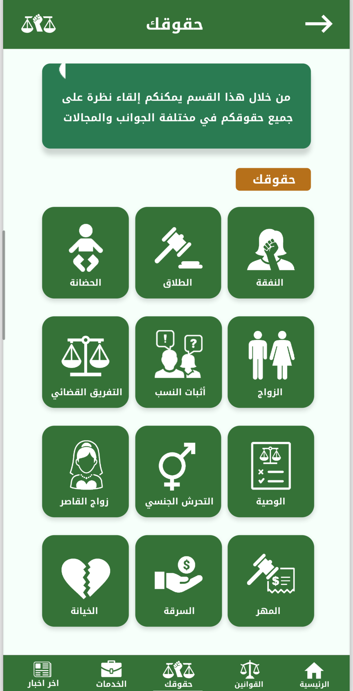

# Cervigo App

Cervigo App is a simple and intuitive Flutter-based mobile application for physical medicine doctors. It allows doctors to organize and record their cases information , diagnosis and medicine effectively.

## Table of Contents
- [Features](#features)
- [Screenshots](#screenshots)
- [Getting Started](#getting-started)
- [User Download](#user-download)
- [Usage](#usage)
- [Contributing](#contributing)
- [License](#license)

## Features
- **View Cases**: Easily view your list of cases also show more details about the case diagnosis ,information and intervention in case details screen.
- **Add new case**: insert the case data and diagnosis from simple questions.
- **View videos**: view educational videos for doctors about diagnosis tests.
- **Add interventions**: add the appropriate medicine for the case.
- **Settings**: set some settings related to the doctors.
- **Login**: doctor authentication.
- **Register**: add new doctor.
- **Profile**: Edit doctor data.

## Screenshots

## Techniques and Technologies Used
The ToDo App is built using the following techniques and technologies:

- **Flutter**: A cross-platform UI toolkit for building natively compiled applications for mobile, web, and desktop from a single codebase.

- **Dart**: The programming language used for building Flutter apps.

- **State Management**: We use [Bloc/flutter_bloc] for managing the app's state efficiently.

- **Firebase**: [Firebase Authentication] is used for creating and authenticating doctors data , [Firebase Cloud FireStore] is used for store doctors , cases data and [Firebase files manager] is used for store doctors and cases images.

- **Database**: [Firebase Cloud FireStore] is used for storing doctors and cases data and [SharedPreferences] is used for storing the app settings.

- **UI Components**: We leverage Flutter's rich set of UI components and widgets for creating a seamless user experience.

- **Version Control**: Git and GitHub are used for version control .

- **Testing**: [Flutter's built-in testing tools] is used for testing the app's functionality.

## User Download
To run the app on android machine tap on the link from the desird android machine :-
- [Download for Android](https://drive.google.com/file/d/1jWr_3xa5ctrglg9HjnAX80rbRULODau3/view?usp=sharing)

## Usage
1. Open the app on your device.
2. Register through  the "register" screen.
3. To add a new case, click the "+" button, enter the case information, and answer the questions.
4. view the case details and add new intervention.
5. save the information.
6. view videos from videos screen.
7. edit your data from profile screen.
8. edit the settings and logout from settings screen.
9. login if you want to login from login screen.

## Contributing
We welcome contributions to the Cervigo App! If you'd like to contribute, please follow these guidelines:

- [How to suggest a new feature](CONTRIBUTING.md#suggesting-a-feature)

## License
Cervigo App is open-source software.

## Acknowledgments
- Special thanks to the Flutter community for their support and contributions.

## Contact
If you have any questions or need assistance, feel free to reach out to us at [ahmedlotfy5853@yahoo.com](mailto:ahmedlotfy5853@yahoo.com).
